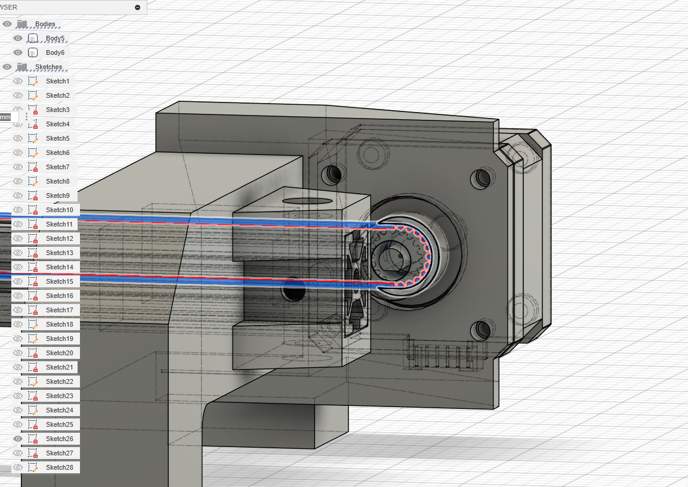

# Motorized Camera Slider

A Camera mount that is controlled by joysticks for cinematography

## Info
- Made By: James C
- Repository Link: https://github.com/ThePathOfLeastResistance/MotorizedCameraSlider
- Total Time Spent: TBD
- Created_at: 2025-06-25

## 2025-06-25 - Outlined Goals and Brainstormed (2.5 hrs)
I looked a lot at the commercially available options for camera sliders for design inspirations since I have not taken any cinematography class in a while and hence would not know much about filming. A lot of the time was brainstorming for this project. Spent writing down the goals that I had for this project, which were to have a light frame so that it can be attached to a tripod; a smooth rotation/movement which will be driven by stepper drivers; try out PCB designing by making a CNC shield for an ESP32 board; also, having the robot be controlled by a ps3 or ps4 controller with minimum setup required. I also started to think of the different brackets and configurations that I could do for the linear joint, rather a 2020 aluminum extrusion with linear rails, or aluminum bars with bearings. Based on the cost and weight, I choose with one linear guide rail with the frame being just one 2020 bar. The concern that I had was the frame being unstable or prone to tipping. 

There were a lot of images that I did not use since it would make this journal very messy, check out the images here: Link

   
   
   

## 2025-06-26 -  Make a rough outline and improving design (2 hrs)
Based youtube videos, I thought the best option would be to have a belt system for the y axis, and based on my experience dealing with gears in my past projects I choose to also use belt systems for the rotation of the x and z axis. I decided to change the design later and try to making a working prototype first. So for the design I had assumed I would be using an arduino shield as the control board. Based on a 1:1 ratio, I drafted different sizes for the side brackets. Also I was able to come up with a way to secure the 2020 bar to the bracket with a strong bond using 2020 nuts and M screws. 

   
   
   

## 2025-06-27 -  Rough Outline and Improve [Again] (3 hrs)
From How to Mechatronics's website, I got a good idea of what was needed to be design: A calibration system, a bracket to mount the rotating arms to the linear rail block( Very important), and the control method. The calibration system was very simple as I just had to figure out where to put the button. But I had spent alot alot of time trying to design and figure out the design for the bracket to connect the linear block to camera arm since it needed to handle a lot of stress while being compact and 3D printable.

   
   
   
   

## 2025-06-28 -  Starting The Design in Fusion (1.5 hrs)
Since most of the design had already been sketched, it was really quick to transfer the design into fusion. Most of the time was actually spent on finding 3D models of things like the 2020 extrunsions and importing them into Fusion without having something mess up. This happened a lot, not too sure why, like with the linear guide rails, when I imported them, and converted the mesh into a object, the surfaces just started warpping, same thing happened with the 2020 bar. 

   
   
   

## 2025-06-29 -  Added the Motor Mount and the GT2 pulley (3 hrs)
Imported models for the Nema17 stepper motors and the 6mm GT2 pulleys. Once alined with the predetermined position, the mounts were made. I also imported a Arduino uni with an CNC shield for a place holer. But also, loading the mounts into orca slicer, the amount of supports neede to print each item was insne. Hence, I changed one side to make it easier to print. 

   
   
   
   

## 2025-06-31 to 2025-07-1 Made the Bracket for the Linear Rail Block (5 hrs)

While designing the mount, I had ran into the issues of the belt being too far from linear rail interms of the y direction. So I had to change from my orginial sketchs since those would require the belt to be on the same levels of the linear block. It was hard to decided where to put the motors for the best rigidy, while also making sure that the center of mass is as close to the 2020 bar as possible. 

   
   
   

   
   

